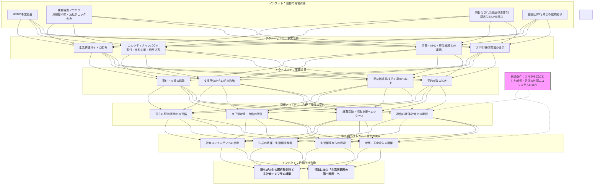

# -
事業インパクト図
# 事業インパクト図

```mermaid
graph TD
    %% graph TD
    %% Input: 経営資源
    subgraph Input [インプット：独自の経営資源]
        A1[MVNO事業基盤]
        A2[独自審査ノウハウ<br/>滞納歴不問・反社チェックのみ]
        A3[内製化された高速改善体制<br/>請求/CS/LINE対応]
        A4[支援団体/行政との信頼関係]
    end

    %% Activities: 主要な活動
    subgraph Activities [アクティビティ：事業活動]
        B1[スマホ/通信環境の提供]
        B2[行政・NPO・更生施設との連携]
        B3[コレクティブインパクト<br/>寄付・食料支援・相互送客]
        B4[生活再建ガイドの配布]
    end

    %% Outputs: 直接的な成果
    subgraph Outputs [アウトプット：事業成果]
        C1[契約者数の拡大]
        C2[高い継続率/支払い率95%以上]
        C3[支援団体からの紹介数増]
        C4[寄付・支援の総量]
    end

    %% Short-term Outcomes: 初期変化
    subgraph ShortOutcomes [初期アウトカム：心理・環境の変化]
        D1[通信の確保/社会との接続]
        D2[就職活動・行政支援へのアクセス]
        D3[自己肯定感・自信の回復]
        D4[孤立の解消/家族との連絡]
    end

    %% Mid-long term Outcomes: 社会的変化
    subgraph LongOutcomes [中長期アウトカム：自立の実現]
        E1[就業・安定収入の確保]
        E2[生活保護からの脱却]
        E3[住居の確保・生活環境改善]
        E4[社会コミュニティへの参画]
    end

    %% Final Impact: 究極の目的
    subgraph Impact [インパクト：目指す社会像]
        F1[<b>行政に並ぶ「生活困窮時の第一想起」へ</b>]
        F2[<b>誰もが人生の選択肢を持てる社会インフラの構築</b>]
    end

    %% Connections
    A1 & A2 & A3 & A4 --> B1 & B2 & B3 & B4
    B1 & B2 & B3 & B4 --> C1 & C2 & C3 & C4
    C1 & C2 & C3 & C4 --> D1 & D2 & D3 & D4
    D1 & D2 & D3 & D4 --> E1 & E2 & E3 & E4
    E1 & E2 & E3 & E4 --> F1 & F2

    %% Assumptions
    classDef assumption fill:#f9f,stroke:#333,stroke-width:2px;
    G[前提条件：スマホを起点とした就労・居住の外部エコシステムの存在]:::assumption
    G -.-> D1
    G -.-> E1
    ...
```
